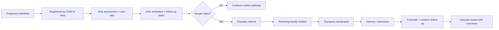
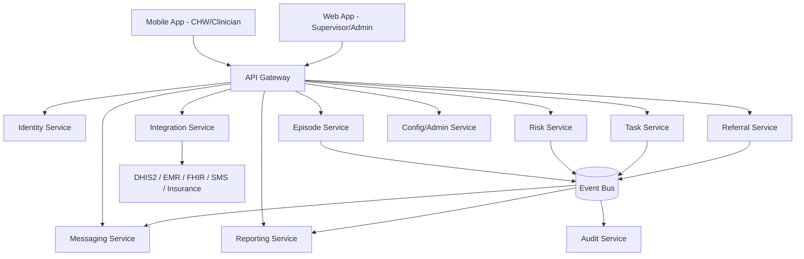
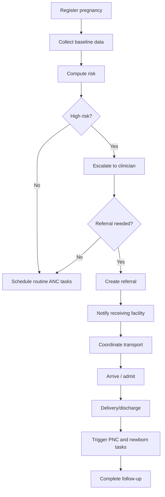
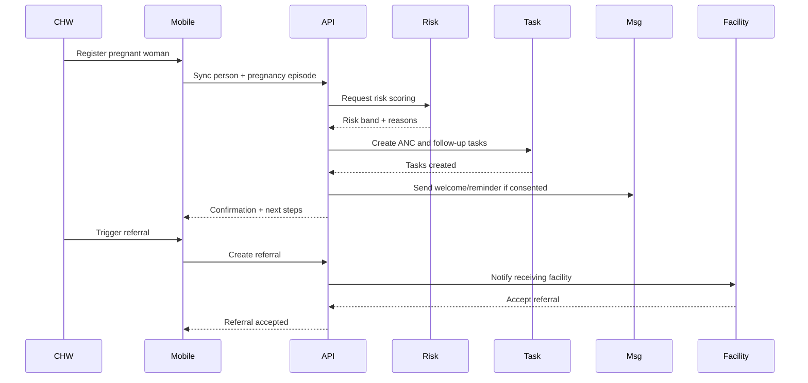
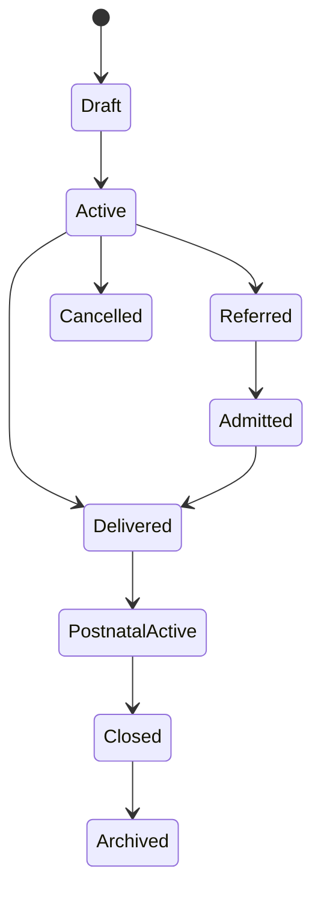
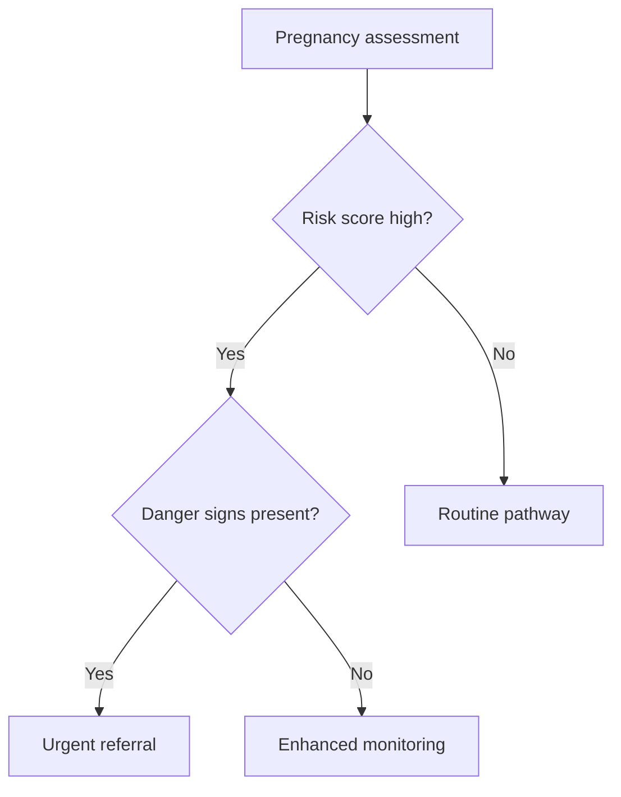

# AMHOS PRD/SRS

**Full title:** AI Maternal Health Operating System PRD/SRS
**Document version:** 1.0
**Document type:** Product Requirements Document (PRD) + Software Requirements Specification (SRS)
**Prepared for:** Executive, Product, Design, Engineering, QA, DevOps, Security, Data, and Implementation teams
**Standards basis:** IEEE 830, BABOK, PMI Business Analysis, DDD, REST/OpenAPI, OWASP, Cloud Native, WCAG, GDPR/NDPR-aligned principles
**Status:** Draft for design review
**Date:** 2026-07-11

> **Important note on missing inputs:** The request asks not to assume missing information and to ask clarifying questions. No uploaded product-specific documents were available in the workspace, and several commercial inputs were not provided. This document therefore distinguishes between **verified evidence**, **assumptions**, and **open questions**. Any item marked *Assumption* must be confirmed during discovery before commitment.

### Clarifying questions requiring confirmation

1. Which launch country is preferred for MVP: Kenya, Uganda, Tanzania, Nigeria, or another market?
2. Is the first paying customer segment government, NGO/implementer, insurer, employer, or private provider network?
3. Is the preferred product scope RMNCH only, or maternal/newborn first with later child health expansion?
4. Is ambulance dispatch in scope for MVP, or only referral coordination?
5. Should the product be positioned as a national digital public health platform, a provider SaaS, or a hybrid implementation model?
6. Are any existing national systems mandatory integration targets, such as DHIS2, OpenMRS, EMR/EHR, HMIS, NHIF/insurance, SMS gateways, or identity systems?
7. Which hosting model is acceptable: regional cloud, country-resident cloud, government data center, or hybrid?
8. Which languages are needed for MVP UX and messaging?
9. Is the platform intended to support clinical decision support that may require medical device or software-as-medical-device review in the first market?
10. What target implementation budget and timeline are available for the first 12 months?

Until these are answered, the document proceeds with explicit assumptions.

## 1. Executive Summary

### Product Overview

**Product Name:** AI Maternal Health Operating System (AMHOS)
**Industry:** Digital health / maternal and newborn health / enterprise SaaS / public health infrastructure
**Product Type:** Mobile + Web + SaaS + interoperability platform + workflow orchestration
**Business Model:** Primarily B2G/B2B2G SaaS plus implementation, onboarding, training, analytics, and support services
**Primary Market:** High-burden African countries with maternal/newborn mortality challenges and basic digital readiness
**Core Problem:** Maternal and newborn care is fragmented across community workers, clinics, hospitals, and emergency/referral pathways, causing preventable delays, missed risk detection, poor follow-up, and avoidable mortality [cite:62][cite:107].

### Vision

To become the trusted digital operating layer for maternal and newborn care coordination across Africa, ensuring that every pregnancy is registered, every risk is triaged, every referral is tracked, and every mother and newborn receives timely follow-up.

### Mission

Enable governments, provider networks, and implementation partners to reduce preventable maternal and newborn deaths by delivering an offline-first, interoperable, workflow-native platform that connects women, community health workers, clinics, hospitals, and referral transport using actionable data and responsible AI.

### Business Objectives

- Reduce missed antenatal, delivery, referral, and postnatal follow-up events.
- Improve continuity of care from pregnancy registration through postpartum and neonatal follow-up.
- Provide district and national stakeholders with auditable operational visibility.
- Create a scalable enterprise platform that can be deployed across multiple African markets.
- Establish a defensible data and workflow moat through interoperability, implementation depth, and measurable outcomes.

### Value Proposition

For ministries, NGOs, insurers, and provider networks, AMHOS offers a single operating platform for maternal-newborn pathway management instead of fragmented paper, spreadsheet, SMS, and siloed app workflows. For frontline workers, it reduces manual tracking, improves referral coordination, and prioritizes high-risk cases. For pregnant women and caregivers, it increases the likelihood of timely care and follow-up.

## 2. Background

### Current Process

Typical maternal care delivery across many African settings is fragmented. Pregnancy may be identified at community level, documented on paper or in a local app, then partially re-entered at a clinic, with referral notes handled manually and postnatal tracking inconsistently performed. Hospitals often lack advance visibility into incoming high-risk cases, while district teams see delayed aggregate data rather than operational alerts [cite:62][cite:107][cite:115].

### Current Challenges

- Pregnancy records are fragmented across paper, facility systems, and community registers.
- Risk detection often occurs late or inconsistently.
- Referral handoffs are weak; transport availability is unclear.
- Postnatal follow-up is incomplete, especially within 48 hours and six weeks postpartum [cite:62][cite:117].
- Connectivity, digital literacy, device access, and interoperability remain major barriers [cite:107][cite:115].
- Many digital programs are pilots and fail to scale or integrate into national workflows [cite:109][cite:112].

### Market Opportunity

WHO reports that the African region still accounts for about 70% of global maternal deaths, with an estimated 178,000 maternal deaths and 1 million newborn deaths each year [cite:16]. Integrated digital systems in Kenya have shown improved ANC attendance, skilled delivery, and postnatal checks in underserved settings [cite:62]. This creates a high-impact opportunity for a workflow platform that is operationally embedded rather than informational only.

### Problem Statement

Maternal and newborn mortality remains high in Africa not only because of clinical disease burden, but because the healthcare delivery chain is operationally broken. Women are not consistently identified early, triaged accurately, referred reliably, transported promptly, or followed through postpartum care. Existing systems fail to provide a shared, real-time, interoperable workflow connecting community workers, facilities, and supervisors [cite:16][cite:62][cite:107].

### Root Cause Analysis

#### 5 Whys

1. Why are mothers and newborns dying from preventable causes? Because care is delayed, incomplete, or poor quality.
2. Why is care delayed or incomplete? Because pregnancy monitoring, referral, and follow-up workflows are fragmented.
3. Why are workflows fragmented? Because records, communication, and accountability are split across actors and systems.
4. Why are systems split? Because digital adoption is uneven, interoperability is weak, and operational ownership is diffuse.
5. Why is interoperability and ownership weak? Because incentives, procurement, infrastructure, and implementation models favor siloed programs over integrated service operations [cite:115][cite:107].

#### Symptoms vs real causes

| Symptoms | Real causes |
|---|---|
| Missed ANC visits | Weak registration, reminders, and follow-up ownership |
| Late referral | No shared triage, transport visibility, or escalation workflow |
| Poor postnatal follow-up | CHW/facility disconnect and lack of task orchestration |
| Duplicate data entry | Non-interoperable systems and paper dependence |
| Low adoption | Poor workflow fit, training gaps, device/connectivity constraints |

## 3. Goals

### Business Goals

- Secure 1 to 3 paid pilots within 12 months.
- Achieve measurable clinical workflow improvement in at least three core indicators.
- Build a reusable platform architecture suitable for multi-country deployment.
- Reach positive gross margin on software plus support services by Year 3.

### Product Goals

- Register pregnancies and create longitudinal maternal-newborn episodes.
- Support AI-assisted risk stratification and task prioritization.
- Coordinate referrals across CHWs, clinics, hospitals, and transport actors.
- Track postnatal and newborn follow-up compliance.
- Provide dashboards and reporting for providers and health administrators.

### User Goals

- CHWs need simple offline tools to register, follow up, and escalate risk.
- Midwives and clinicians need better visibility into patient history and pending referrals.
- Supervisors need actionable operational dashboards instead of retrospective reports.
- Pregnant women need reminders, education, and a channel for seeking help.

### Technical Goals

- Offline-first mobile architecture.
- Standards-based interoperability.
- Cloud-native, multi-tenant platform with tenant isolation.
- Event-driven workflow engine for notifications, escalations, and analytics.
- High auditability and secure handling of sensitive health data.

### Compliance Goals

- Align with national health data governance rules in launch markets.
- Implement GDPR/NDPR-style privacy controls where applicable.
- Implement OWASP-aligned secure development and operations.
- Support WCAG 2.2 AA accessibility targets for web UX.

## 4. Stakeholders

| Group | Stakeholders | Interest / responsibility |
|---|---|---|
| Executive | CEO, COO, Chief Medical Officer, Country GM | Strategy, funding, partnerships, outcomes |
| Business | Product, commercial, implementation, partnerships | Packaging, pricing, deployment success |
| Engineering | Architects, backend, frontend, mobile, data, QA, DevOps, security | Design and delivery |
| Operations | Support, training, customer success, field implementation | Adoption and uptime |
| Compliance | Legal, privacy, info-sec, clinical governance | Regulatory and security oversight |
| External Partners | Ministries, NGOs, hospitals, insurers, ambulance networks, SMS providers, labs | Integration, procurement, service delivery |

## 5. User Personas

### Persona 1: Community Health Worker (CHW)

- **Description:** Frontline worker managing households and pregnancy follow-up in rural/peri-urban settings.
- **Goals:** Register pregnancies quickly, receive visit tasks, escalate danger signs, confirm follow-up.
- **Frustrations:** Paper burden, poor connectivity, unclear escalation pathways, device limitations.
- **Technical literacy:** Low to medium.
- **Usage frequency:** Daily.
- **Pain points:** Duplicate data entry, no real-time feedback, difficulty tracking referrals.

### Persona 2: Midwife / Nurse

- **Description:** Facility-based user responsible for ANC, delivery, postpartum, and documentation.
- **Goals:** View patient history, assess risk, manage referrals and follow-up.
- **Frustrations:** Missing histories, crowded workflow, non-integrated systems.
- **Technical literacy:** Medium.
- **Usage frequency:** Daily.
- **Pain points:** Time pressure, incomplete records, inconsistent patient return.

### Persona 3: Obstetric Clinician / Hospital Team

- **Description:** High-acuity provider handling complicated maternal/newborn cases.
- **Goals:** Receive advance notice, prioritize high-risk cases, access referral details.
- **Frustrations:** Late referrals, inadequate handover, limited transport visibility.
- **Technical literacy:** Medium to high.
- **Usage frequency:** Daily.
- **Pain points:** Avoidable emergencies, poor coordination, missing data.

### Persona 4: District Reproductive Health Coordinator

- **Description:** Government or NGO supervisor managing performance across facilities.
- **Goals:** See high-risk patterns, monitor coverage, intervene operationally.
- **Frustrations:** Retrospective reporting, spreadsheet consolidation, incomplete field data.
- **Technical literacy:** Medium.
- **Usage frequency:** Several times per week.
- **Pain points:** Delayed decisions, poor accountability, limited resource visibility.

### Persona 5: Pregnant Woman / Mother

- **Description:** End user receiving education, reminders, follow-up, and emergency support.
- **Goals:** Safe pregnancy, clear guidance, trusted care pathway, affordable transport.
- **Frustrations:** Travel cost, long waits, fragmented care, limited understanding of danger signs.
- **Technical literacy:** Low to medium depending on segment.
- **Usage frequency:** Weekly to monthly, more frequent near due date/postpartum.
- **Pain points:** Anxiety, unclear next steps, financial burden, transport delays.

### Persona 6: Program Manager / NGO Implementer

- **Description:** Buyer/operator deploying maternal health interventions at scale.
- **Goals:** Achieve measurable outcomes, track program KPIs, ensure adoption.
- **Frustrations:** Pilot fragmentation, data quality issues, hard-to-scale implementations.
- **Technical literacy:** Medium to high.
- **Usage frequency:** Weekly.
- **Pain points:** Reporting burden, proving impact, managing field teams.

## 6. User Journey

### Current Journey

1. Pregnancy identified informally or during first clinic visit.
2. Registration occurs on paper or a local register.
3. ANC reminders are inconsistent.
4. Complications may be recognized late.
5. Referral is manual via paper note/phone call.
6. Transport is arranged ad hoc.
7. Delivery occurs with limited shared context.
8. Postnatal and newborn follow-up may be missed.

### Future Journey

1. Pregnancy is registered once by CHW or clinic.
2. Risk is scored and a care plan is created.
3. Automated tasks, reminders, and follow-ups are scheduled.
4. Danger signs trigger escalation and referral workflows.
5. Receiving facility gets pre-arrival visibility.
6. Transport/referral status is tracked.
7. Delivery and discharge update the shared episode.
8. Postnatal and newborn follow-up tasks are orchestrated and auditable.

### Pain Points

- Fragmented identity and records.
- Missed follow-up ownership.
- Slow escalation.
- No single operational dashboard.
- Weak feedback loop between community and facility.

### Opportunities

- Unified maternal episode record.
- AI-assisted prioritization.
- Referral control tower.
- Messaging automation.
- Outcome-linked analytics.

### Journey Diagram (text)



## 7. Functional Requirements

### Module 1: Identity & Pregnancy Registration

- **Purpose:** Create and manage a longitudinal maternal-newborn episode.
- **Business Rules:** One active pregnancy episode per mother unless clinical exception is documented; identity may be probabilistic in low-ID environments.
- **Features:** New registration, search/match, household linkage, pregnancy timeline.
- **User Stories:** As a CHW, I want to register a pregnant woman offline so that care can begin immediately.
- **Acceptance Criteria:** Registration works offline; duplicate warning appears if probable match exists; sync resolves conflicts deterministically.
- **Priority:** P0
- **Dependencies:** Mobile app, sync service, master patient index.
- **Edge Cases:** Unknown age, no phone, no national ID, multiple gestation.
- **Validation Rules:** Required fields configurable by country; gestational age cannot be negative; expected delivery date must be plausible.
- **Error Handling:** Save draft locally; show sync queue errors with retry.

### Module 2: Risk Scoring & Clinical Triage

- **Purpose:** Identify high-risk pregnancies and prioritize action.
- **Business Rules:** AI risk score is advisory, not autonomous clinical decision-making in MVP.
- **Features:** Rule-based and ML-assisted risk scoring, risk banding, explainability hints.
- **User Stories:** As a midwife, I want to see risk factors ranked so I can prioritize review.
- **Acceptance Criteria:** Score recalculates when clinical data changes; reason codes displayed; clinicians can override.
- **Priority:** P0
- **Dependencies:** Clinical rules engine, model service, audit trail.
- **Edge Cases:** Missing vitals, conflicting inputs, model unavailable.
- **Validation Rules:** BP, temperature, anemia markers, prior complications within valid ranges.
- **Error Handling:** Fallback to deterministic rules if AI unavailable.

### Module 3: Tasking, Visits & Follow-up

- **Purpose:** Orchestrate ANC, home visits, postpartum, and newborn follow-up.
- **Business Rules:** Task SLAs configurable by care stage and risk level.
- **Features:** Visit scheduling, task lists, missed-visit escalation, completion capture.
- **Priority:** P0

### Module 4: Referral & Transport Coordination

- **Purpose:** Manage escalation from community/clinic to higher-level care and optionally ambulance dispatch.
- **Business Rules:** Referral closure requires receiving-facility acknowledgment or documented failure reason.
- **Features:** Referral creation, facility selection, bed/service readiness flags, dispatch status, transfer timeline.
- **Priority:** P0/P1 depending on MVP scope.

### Module 5: Messaging & Patient Engagement

- **Purpose:** Communicate reminders, education, and urgent instructions.
- **Business Rules:** Consent required for outbound personal messaging; content localized by language and literacy profile.
- **Features:** SMS, IVR, WhatsApp/app messaging where supported, two-way helpdesk, templating.
- **Priority:** P1

### Module 6: Facility Workflow & Case Management

- **Purpose:** Support ANC, labor, delivery, discharge, and postnatal documentation.
- **Business Rules:** Role-based access by facility type; high-risk cases prioritized in queues.
- **Features:** Case list, triage board, encounter notes, discharge summary, referral outcome capture.
- **Priority:** P0

### Module 7: Supervisor Dashboards & Reporting

- **Purpose:** Give district/program managers operational and executive visibility.
- **Business Rules:** Aggregate reporting by tenant and geography; row-level access restricted.
- **Features:** KPI dashboards, cohort views, heat maps, SLA breach alerts, export/API feeds.
- **Priority:** P0

### Module 8: Interoperability & Data Exchange

- **Purpose:** Exchange data with DHIS2, EMRs, labs, insurance, messaging, and identity systems.
- **Business Rules:** Standards-first adapters; asynchronous retries with reconciliation.
- **Features:** HL7 FHIR-aligned resources where feasible, REST APIs, webhooks, batch exports.
- **Priority:** P0

### Module 9: Admin, Tenant Management & Configuration

- **Purpose:** Support multi-country, multi-program operations.
- **Features:** Tenant config, roles, care pathway rules, facility hierarchy, localization, audit review.
- **Priority:** P0

### Module 10: Analytics, AI Ops & Model Governance

- **Purpose:** Measure product impact and manage models responsibly.
- **Features:** Model performance monitoring, drift alerts, fairness diagnostics, intervention impact analytics.
- **Priority:** P1/P2

## 8. Detailed Feature Specification

### Feature: Pregnancy Registration

| Item | Specification |
|---|---|
| Description | Register a pregnant woman and create a maternal episode |
| Workflow | Search existing person -> create/update person -> create pregnancy episode -> assign care plan -> schedule tasks |
| Sequence | CHW/clinician opens registration, captures demographics and pregnancy details, app validates, stores locally, syncs later if offline |
| Actors | CHW, nurse, admin system |
| Business Logic | Duplicate detection uses deterministic identifiers plus fuzzy matching |
| API dependencies | Identity service, episode service, sync gateway |
| Notifications | Optional welcome SMS/IVR after consent |
| Permissions | CHW create/read limited scope; clinician broader read/update |
| Configurations | Country-specific mandatory fields, language, referral zones |
| States | Draft, Active, Referred, Delivered, Closed, Archived |
| Exceptions | Suspected duplicate, missing phone, consent denied |

### Feature: AI Risk Score

| Item | Specification |
|---|---|
| Description | Advisory risk score combining rules and model outputs |
| Workflow | Triggered on registration and clinical updates |
| Actors | Clinician, CHW, model service |
| Business Logic | Rule engine first, ML enrichment second, clinician override logged |
| API dependencies | Risk service, model registry, audit service |
| Notifications | Alert to assigned worker/supervisor when high risk |
| Permissions | View for care team; model config limited to admins/data science |
| States | Pending, Computed, Overridden, Failed, FallbackRuleOnly |
| Exceptions | Missing inputs, stale model, unsupported population |

### Feature: Referral Management

| Item | Specification |
|---|---|
| Description | End-to-end referral workflow from origin to receiving facility |
| Workflow | Create referral -> notify receiving facility -> coordinate transport -> update milestones -> close referral |
| Actors | CHW, nurse, hospital, dispatcher |
| Business Logic | Time stamps are immutable audit events; facility acceptance may be explicit or timeout-based |
| API dependencies | Facility directory, dispatch integration, messaging service |
| Notifications | Referral created, accepted, departed, arrived, failed |
| Permissions | Origin create, receiving update, supervisor monitor |
| States | Created, Sent, Accepted, Dispatched, InTransit, Arrived, Completed, Failed, Cancelled |
| Exceptions | No facility response, no transport, patient declines, communication failure |

### Feature: Postnatal Follow-up

| Item | Specification |
|---|---|
| Description | Orchestrate postnatal and newborn follow-up tasks |
| Workflow | Delivery/discharge triggers task generation by risk band and pathway |
| Actors | CHW, nurse, caregiver |
| Business Logic | Time windows configurable, missed visits escalate automatically |
| API dependencies | Task service, messaging service, analytics service |
| Notifications | Mother reminders, worker reminders, supervisor escalations |
| States | Scheduled, Due, Completed, Missed, Escalated, Closed |
| Exceptions | Stillbirth, neonatal death, relocation, wrong contact |

## 9. Non-Functional Requirements

| Category | Requirement |
|---|---|
| Performance | P95 API latency under 500 ms for normal reads; under 2 s for complex dashboards |
| Scalability | Support 5 countries, 50,000 frontline users, 5 million maternal episodes over 5 years (Assumption) |
| Availability | 99.9% monthly uptime for core APIs excluding scheduled maintenance |
| Reliability | Offline-first mobile with eventual consistency and conflict resolution |
| Maintainability | Modular services, CI quality gates, automated tests, ADRs |
| Accessibility | WCAG 2.2 AA web support; mobile accessible patterns where platform permits |
| Localization | English-first MVP; architecture supports multiple languages and locale rules |
| Auditability | Immutable audit events for clinical workflow, access, configuration, and AI overrides |
| Logging | Structured logs with PII minimization |
| Monitoring | SLOs, alerting, tracing, synthetic checks |
| Observability | Distributed tracing across microservices |
| Disaster Recovery | RPO <= 15 minutes, RTO <= 4 hours |
| Backup | Encrypted automated backups daily + point-in-time recovery |
| Compliance | Configurable data retention and data residency policies |
| Security | Zero-trust service auth, RBAC/ABAC, encryption in transit and at rest |
| Encryption | TLS 1.2+, AES-256 at rest, envelope encryption for sensitive fields |
| Latency | Mobile screens usable within 2 seconds on low-end Android for cached flows |
| Browser Support | Latest 2 versions of Chrome, Edge, Safari, Firefox |
| Offline Support | Critical mobile workflows available with local queueing |

## 10. Software Architecture

### Architecture Style

Recommended architecture: **modular microservices with event-driven workflow orchestration**, API-first, cloud-native, multi-tenant SaaS. Use a modular monolith only if funding, speed, or team maturity demands a simplified MVP. Long-term target remains service-oriented.

### Bounded Contexts

- Identity & Consent
- Maternal Episode Management
- Risk & Decision Support
- Tasking & Scheduling
- Referral & Transport
- Messaging & Engagement
- Facility Operations
- Reporting & Analytics
- Tenant Configuration
- Interoperability
- Audit & Security

### Services

| Service | Responsibilities |
|---|---|
| API Gateway | Routing, auth enforcement, rate limits |
| Identity Service | Person records, matching, consent |
| Episode Service | Pregnancy/newborn episodes, lifecycle |
| Risk Service | Rules, scoring, explainability |
| Task Service | Care tasks, SLAs, escalations |
| Referral Service | Referral creation, milestones, closure |
| Messaging Service | SMS/IVR/WhatsApp/email orchestration |
| Facility Service | Facility directory, capacity metadata |
| Reporting Service | KPIs, exports, cohort views |
| Integration Service | DHIS2/FHIR/EMR/insurance adapters |
| Notification/Event Bus | Async events and workflow triggers |
| Audit Service | Immutable audit trail |
| Admin Service | Tenant and config management |

### Component Diagram (text)



### Deployment Model

- Kubernetes-managed containers in cloud or hybrid environment.
- Separate environments: dev, test, staging, prod.
- Per-tenant logical isolation; optional dedicated deployment for national contracts.
- Regional deployment patterns to satisfy data residency where required.

### Technology Recommendations

- **Mobile:** Android-first Kotlin or Flutter; offline local DB.
- **Web:** React/Next.js or Angular enterprise stack.
- **Backend:** Java/Kotlin Spring Boot or .NET; or TypeScript/NestJS for faster iteration if team fit favors it.
- **Data:** PostgreSQL, Redis, object storage, warehouse/lakehouse for analytics.
- **Events:** Kafka / Redpanda / cloud pub-sub.
- **Workflow engine:** Temporal / Camunda / custom event orchestration depending complexity.
- **Observability:** OpenTelemetry, Prometheus, Grafana, Loki/ELK.
- **Auth:** OAuth 2.1 / OIDC with centralized IAM.

## 11. Domain Model

### Entities

- Person
- Household
- ConsentRecord
- PregnancyEpisode
- NewbornEpisode
- Encounter
- RiskAssessment
- CareTask
- Referral
- Facility
- FacilityCapacitySnapshot
- TransportRequest
- Message
- NotificationTemplate
- Organization/Tenant
- User
- Role
- AuditEvent
- IntegrationSubscription

### Aggregates

- **Person Aggregate:** Person, household link, consent preferences
- **Maternal Episode Aggregate:** PregnancyEpisode, encounters, risk assessments, tasks, referral links
- **Referral Aggregate:** Referral, milestones, transport request, receiving-facility response
- **Tenant Aggregate:** Organization, facilities, users, configs

### Value Objects

- Address
- PhoneNumber
- GestationalAge
- VitalSigns
- RiskBand
- ConsentPreferences
- FacilityCode
- TimeWindow

### Relationships

- Person 1..* PregnancyEpisode
- PregnancyEpisode 0..* Encounter
- PregnancyEpisode 0..* RiskAssessment
- PregnancyEpisode 0..* CareTask
- PregnancyEpisode 0..* Referral
- PregnancyEpisode 0..* NewbornEpisode
- Facility 1..* Users

### Lifecycle

PregnancyEpisode: Draft -> Active -> Referred/Admitted (optional loops) -> Delivered -> PostnatalActive -> Closed -> Archived

## 12. Data Model

### Core Entity Definitions

#### person

| Field | Type | Constraints / notes |
|---|---|---|
| person_id | UUID | PK |
| tenant_id | UUID | FK, indexed |
| external_id | varchar(64) | nullable, unique per tenant |
| first_name | varchar(120) | required |
| last_name | varchar(120) | nullable |
| date_of_birth | date | nullable |
| sex | varchar(20) | required, controlled vocabulary |
| phone_primary | varchar(32) | nullable, indexed |
| national_id_hash | varchar(128) | nullable, unique when present |
| address_json | jsonb | nullable |
| created_at | timestamptz | audit |
| updated_at | timestamptz | audit |
| deleted_at | timestamptz | soft delete |
| created_by | UUID | audit |
| updated_by | UUID | audit |

#### pregnancy_episode

| Field | Type | Constraints / notes |
|---|---|---|
| pregnancy_episode_id | UUID | PK |
| tenant_id | UUID | FK, indexed |
| person_id | UUID | FK, indexed |
| lmp_date | date | nullable |
| estimated_delivery_date | date | nullable |
| gestational_age_weeks | integer | derived or entered |
| risk_band | varchar(20) | indexed |
| status | varchar(30) | indexed |
| facility_id | UUID | nullable |
| chw_user_id | UUID | nullable |
| source | varchar(30) | community/facility/import |
| created_at | timestamptz | audit |
| updated_at | timestamptz | audit |
| deleted_at | timestamptz | soft delete |

#### risk_assessment

| Field | Type | Constraints / notes |
|---|---|---|
| risk_assessment_id | UUID | PK |
| pregnancy_episode_id | UUID | FK, indexed |
| assessment_time | timestamptz | required |
| rule_score | numeric(10,4) | required |
| ml_score | numeric(10,4) | nullable |
| final_risk_band | varchar(20) | indexed |
| explanation_json | jsonb | required |
| overridden_by | UUID | nullable |
| override_reason | text | nullable |

#### care_task

| Field | Type | Constraints / notes |
|---|---|---|
| care_task_id | UUID | PK |
| pregnancy_episode_id | UUID | FK, indexed |
| newborn_episode_id | UUID | nullable |
| task_type | varchar(40) | indexed |
| assigned_user_id | UUID | nullable |
| due_at | timestamptz | indexed |
| completed_at | timestamptz | nullable |
| status | varchar(20) | indexed |
| priority | varchar(20) | indexed |
| sla_breach_at | timestamptz | nullable |

#### referral

| Field | Type | Constraints / notes |
|---|---|---|
| referral_id | UUID | PK |
| pregnancy_episode_id | UUID | FK, indexed |
| from_facility_id | UUID | nullable |
| to_facility_id | UUID | nullable, indexed |
| reason_code | varchar(40) | required |
| urgency | varchar(20) | required |
| status | varchar(30) | indexed |
| created_at | timestamptz | required |
| accepted_at | timestamptz | nullable |
| departed_at | timestamptz | nullable |
| arrived_at | timestamptz | nullable |
| closed_at | timestamptz | nullable |

#### audit_event

| Field | Type | Constraints / notes |
|---|---|---|
| audit_event_id | UUID | PK |
| tenant_id | UUID | indexed |
| actor_user_id | UUID | nullable |
| actor_type | varchar(30) | user/system/integration |
| entity_type | varchar(50) | indexed |
| entity_id | UUID | indexed |
| action | varchar(60) | indexed |
| event_time | timestamptz | indexed |
| metadata_json | jsonb | required |

**Indexing guidance:** Composite indexes on `(tenant_id, status)`, `(tenant_id, due_at)`, `(tenant_id, risk_band)`, and event-time partitions for audit/analytics tables.
**Unique rules:** One active pregnancy episode per person per tenant unless marked as multiple concurrent or data exception.
**Soft delete:** Enabled for business entities, prohibited for immutable audit events.

## 13. API Specification

### API Standards

- Base path: `/api/v1`
- Authentication: OAuth 2.1 bearer tokens / OIDC
- Content type: `application/json`
- Correlation header: `X-Correlation-Id`
- Idempotency header for create/update operations where needed: `Idempotency-Key`
- Pagination: cursor-based preferred for large result sets
- Filtering: query params, documented per resource
- Sorting: whitelist only
- Rate limits: tenant and client scoped

### Example APIs

#### Create person

- **Endpoint:** `POST /api/v1/persons`
- **Purpose:** Create a person profile
- **Authentication:** Bearer token
- **Headers:** Authorization, X-Correlation-Id, optional Idempotency-Key
- **Request:**

```json
{
  "firstName": "Amina",
  "lastName": "Ali",
  "dateOfBirth": "1998-06-10",
  "sex": "female",
  "phonePrimary": "+2547XXXXXXXX",
  "address": {"county": "Turkana", "village": "..."}
}
```

- **Response:** `201 Created`

```json
{
  "personId": "uuid",
  "status": "created"
}
```

- **Validation:** sex required; phone format validated by locale; name length caps.
- **Status Codes:** 201, 400, 401, 403, 409, 422, 429, 500
- **Errors:** duplicate detected, invalid payload, unauthorized.

#### Create pregnancy episode

- **Endpoint:** `POST /api/v1/pregnancy-episodes`
- **Purpose:** Start maternal episode
- **Idempotency:** Required for retried mobile creates
- **Validation:** Person must exist; expected delivery date plausible.

#### Get task list

- **Endpoint:** `GET /api/v1/tasks?status=due&assignedUserId=...`
- **Purpose:** Retrieve due tasks for worker
- **Pagination:** Cursor or limit/offset for low-volume endpoints
- **Sorting:** by dueAt asc only in MVP

#### Create referral

- **Endpoint:** `POST /api/v1/referrals`
- **Purpose:** Create and dispatch referral
- **Validation:** reason code and urgency required; origin must have episode access

#### Update referral status

- **Endpoint:** `PATCH /api/v1/referrals/{id}`
- **Purpose:** Accept, dispatch, arrive, complete, fail
- **Rules:** Valid state transitions only; immutable timestamps once set except admin correction workflow.

#### Risk assessment

- **Endpoint:** `POST /api/v1/pregnancy-episodes/{id}/risk-assessments`
- **Purpose:** Trigger or submit risk assessment
- **Response:** risk band, reasons, model version, fallback indicator

#### Dashboard metrics

- **Endpoint:** `GET /api/v1/reports/maternal-kpis?districtId=...&from=...&to=...`
- **Purpose:** Aggregate KPI reporting for supervisors
- **Rate Limits:** Lower limits due to computational cost

### Error Object Standard

```json
{
  "error": {
    "code": "REFERRAL_INVALID_STATE",
    "message": "Referral cannot transition from Completed to InTransit",
    "details": [],
    "correlationId": "uuid"
  }
}
```

## 14. Security Requirements

### Authentication

- OIDC-compliant identity provider.
- MFA for admin and supervisor roles.
- Device binding or step-up auth for privileged workflows where feasible.

### Authorization

- RBAC plus attribute-based constraints by tenant, geography, facility, and role.
- Principle of least privilege.

### RBAC Roles (initial)

- CHW
- Nurse/Midwife
- Clinician
- Facility Admin
- District Supervisor
- Program Manager
- Tenant Admin
- Support (restricted)
- Integration Client

### Security Controls

- JWT access tokens with short TTL; refresh tokens securely managed.
- PII classification and field-level encryption for highly sensitive attributes.
- Secrets in managed vault, never in code or CI logs.
- OWASP Top 10 mitigations: input validation, output encoding, CSRF controls where relevant, secure headers, rate limiting, SSRF protections, dependency scanning.
- Full audit trail for access to maternal episodes, risk overrides, exports, and config changes.
- Fraud/misuse prevention: abnormal access detection, export throttling, impossible-travel alerts for admin logins.
- Secure file handling for attachments and referrals.

### Privacy

- Consent capture for patient communications and secondary data use.
- Data minimization for analytics views.
- De-identification/pseudonymization for model training and cross-tenant benchmarking.
- Support legal bases, retention schedules, access requests, and deletion/anonymization workflows subject to local law.

## 15. Integrations

### Internal Systems

- CRM / contract management
- Support desk
- Analytics warehouse

### External Integrations

- DHIS2 / HMIS [cite:115]
- EMR/EHR (e.g., OpenMRS or local systems) *Assumption*
- SMS/IVR/WhatsApp gateways
- National/provider insurance systems where applicable [cite:125]
- Facility master data / geolocation
- Optional ambulance dispatch systems

### Integration Requirements

- Webhooks for referral events, task completion, and message delivery status.
- Retry strategy: exponential backoff with dead-letter queue.
- Timeout strategy: 2 to 10 seconds depending on dependency type.
- Fallback strategy: queue and reconcile later for non-critical syncs; display degraded mode to users.
- Failure handling: circuit breakers, alerting, replay tools, reconciliation dashboards.

## 16. Workflow Diagrams

### Activity Diagram



### Sequence Diagram



### State Diagram



### Decision Tree



## 17. UX Requirements

### Navigation

- Role-based home dashboards.
- Mobile bottom navigation for frontline app: Home, Tasks, Clients, Referrals, Profile.
- Web left navigation for supervisors/admins.

### Information Architecture

- Person / Household
- Pregnancy Episode
- Tasks / Visits
- Referrals
- Facility Operations
- Reports
- Admin / Config

### Wireframe Description

- **CHW Home:** due tasks, urgent alerts, offline sync status, quick register.
- **Episode Detail:** overview card, risk band, timeline, tasks, referrals, notes.
- **Referral Console:** open referrals, statuses, filters, map/list view if supported.
- **Supervisor Dashboard:** KPI cards, trend charts, SLA breaches, geography table.

### Forms

- Progressive disclosure; minimum required fields first.
- Large tap targets; explicit save draft.
- Numeric fields with range validation.

### Empty States

- Explain what to do next, not just absence of data.

### Loading States

- Skeletons for dashboards and list screens.
- Explicit sync indicators on mobile.

### Error States

- Clear, actionable language.
- Support retry and offline queue fallback.

### Accessibility

- WCAG AA color and keyboard behavior on web.
- Screen-reader labels and logical focus order.
- Local-language support and low-literacy content patterns for patient messaging.

### Responsive Behaviour

- Web optimized for 1280+ but functional down to tablet.
- Mobile Android-first for frontline workflows.

## 18. Notifications

| Channel | Use cases | Triggers |
|---|---|---|
| SMS | Reminders, referral updates, urgent notices | Upcoming ANC, missed visit, referral accepted |
| IVR | Low-literacy engagement, urgent outreach | Missed tasks, emergency instructions |
| Push | App users with connectivity | Task assigned, sync resolved |
| In-app | Workflow events and warnings | High-risk case, referral state change |
| Email | Admin and executive summaries | Weekly reports, incident notifications |

**Retry Rules:** At-least-once delivery for non-critical notices; deduplication tokenization; backoff for gateway failures.
**Templates:** Country- and language-configurable, clinically approved content library.
**Consent:** Required for patient-facing outbound messaging except where legally permitted for care operations.

## 19. Reporting & Analytics

### Operational Reports

- Due and overdue ANC/PNC tasks
- High-risk pregnancy cohorts
- Referral turnaround time
- Facility acknowledgment rates
- Postnatal follow-up completion

### Executive Dashboard KPIs

- Registered pregnancies
- ANC coverage (1st/4th/8th as configured)
- Skilled delivery rate
- Postnatal check within 48 hours [cite:62]
- Referral SLA adherence
- High-risk case closure rate

### Event Tracking

- Registration created
- Risk score computed
- Task assigned/completed/missed
- Referral created/accepted/arrived/completed
- Message sent/delivered/responded
- Sync success/failure

### Product Analytics

- Active users by role
- Task completion rate
- Median time to referral acceptance
- Feature adoption by geography/facility
- Training and adoption proxies

## 20. QA Requirements

### Test Strategy

- Risk-based testing with strong focus on patient safety, data integrity, offline behavior, and state transitions.
- Mix of unit, integration, contract, end-to-end, security, performance, accessibility, and UAT tests.

### Core Test Scenarios

- New pregnancy registration online/offline
- Duplicate resolution
- Risk scoring with full and partial data
- Referral creation and invalid state changes
- Task generation from delivery event
- Messaging consent enforcement
- Role-based access control
- DHIS2/integration retry and reconciliation

### Positive Tests

- All valid workflows by role.

### Negative Tests

- Missing mandatory fields, invalid vitals, unauthorized access, stale tokens, external dependency failures.

### Boundary Tests

- Extreme gestational ages, vital sign limits, large task queues, concurrent updates.

### Regression Tests

- Episode lifecycle, referral lifecycle, reporting integrity, sync engine, notification rules.

### UAT

- Field validation with CHWs, midwives, and supervisors in pilot geography.

### Automation Candidates

- API, rules engine, state machine, sync conflict tests, security smoke, accessibility linting.

## 21. DevOps

### Environment Strategy

- Local dev, shared dev, QA/test, staging, production.
- Optional country-specific staging for major tenants.

### CI/CD

- Trunk-based development with protected branches.
- Automated lint, unit, integration, contract, SAST, dependency scan, IaC scan, and deployment gates.

### Deployment

- Blue/green or canary for backend services.
- Mobile staged rollout via MDM or store distribution depending deployment model.

### Infrastructure

- Kubernetes, managed DB, managed cache, secrets vault, observability stack.

### Monitoring

- SLO dashboards, error budgets, business KPI alerts, model health alerts.

### Logging

- Centralized structured logs with PII redaction.

### Feature Flags

- Required for country-specific features, integrations, AI rollouts, and pilot cohorts.

### Rollback

- One-click backend rollback; mobile backward compatibility required for at least N-2 supported app versions.

### Release Strategy

- 2-week sprint cadence, monthly release train for stable features, emergency hotfix channel.

## 22. Risks

| Risk Type | Risk | Mitigation |
|---|---|---|
| Business | Long government procurement cycles | Start with NGO/provider pilots; modular procurement packages |
| Business | Weak willingness to pay for software alone | Bundle implementation, reporting, and measurable outcomes |
| Technical | Offline sync conflicts | Strong sync architecture, event sourcing where needed, conflict policies |
| Technical | Integration complexity | Adapter framework, phased integration roadmap |
| Operational | Low adoption by frontline workers | Co-design, training, low-friction UX, field support |
| Operational | Device/connectivity constraints | Offline-first, low-spec Android support, SMS fallback |
| Security | Sensitive health data breach | Defense in depth, encryption, least privilege, monitoring |
| Clinical | Overreliance on AI | Advisory-only AI, explainability, clinician override, governance committee |
| Regulatory | Data residency restrictions | Deployable country-specific hosting options |

## 23. Product Roadmap

### MVP (0-6 months)

- Pregnancy registration
- Episode timeline
- Rule-based + basic AI risk scoring
- Task management for ANC/PNC
- Referral creation and status tracking
- SMS reminders
- Supervisor dashboard
- Core audit trail
- DHIS2 export or basic integration (Assumption based on target market)

### Phase 2 (6-18 months)

- Ambulance/transport coordination
- Two-way messaging/helpdesk
- Facility triage board
- Advanced analytics
- Additional country localization
- Insurance/financing integration where relevant
- Model monitoring and fairness dashboards

### Phase 3 (18-36 months)

- National-scale interoperability layer
- Expanded newborn and child health workflows
- Provider reimbursement and value-based care modules [cite:116]
- Marketplace for diagnostics/transport/support services
- Cross-country benchmarking and planning tools

### Future Enhancements

- Voice interfaces and IVR triage
- Remote monitoring device integration
- Predictive supply and staffing forecasts
- Population health simulations

## 24. Product Backlog

| Epic | Feature | Story | Priority | Story Points | Dependencies | Sprint Recommendation |
|---|---|---|---|---|---|---|
| Registration | Person search/match | As a CHW I can search before creating a new record | P0 | 8 | Identity service | Sprint 1 |
| Registration | Pregnancy episode create | As a CHW I can create a pregnancy episode offline | P0 | 13 | Sync engine | Sprint 1 |
| Risk | Rules engine | As a clinician I can view rule-based risk factors | P0 | 8 | Clinical rules catalog | Sprint 2 |
| Risk | AI score API | As a midwife I can see an advisory risk band | P1 | 13 | Model service | Sprint 4 |
| Tasks | ANC task generator | As system I create tasks from gestational milestones | P0 | 8 | Episode events | Sprint 2 |
| Tasks | Postnatal task generator | As system I create postpartum/newborn tasks after delivery | P0 | 8 | Delivery event | Sprint 3 |
| Referral | Referral workflow | As a nurse I can create and update referrals | P0 | 13 | Facility directory | Sprint 3 |
| Messaging | SMS reminders | As a mother I receive appointment reminders | P1 | 8 | Consent, gateway | Sprint 4 |
| Reporting | Supervisor dashboard | As a district supervisor I can see KPI trends | P0 | 13 | Analytics marts | Sprint 5 |
| Admin | RBAC and tenant setup | As admin I can configure roles and facility hierarchy | P0 | 8 | IAM | Sprint 2 |
| Interop | DHIS2 export | As program manager I can export required metrics | P1 | 8 | Reporting | Sprint 6 |
| Security | Audit trail | As compliance lead I can review critical actions | P0 | 8 | Event bus | Sprint 2 |

## 25. Acceptance Criteria

### Gherkin Scenarios

#### Registration offline

```gherkin
Scenario: Register a pregnant woman while offline
  Given a CHW is authenticated on a mobile device with offline mode enabled
  And no internet connectivity is available
  When the CHW completes the required pregnancy registration fields and taps Save
  Then the record shall be stored locally with status "Pending Sync"
  And the CHW shall see a confirmation that the registration is saved offline
  And the record shall sync automatically when connectivity is restored
```

#### High-risk escalation

```gherkin
Scenario: High-risk pregnancy triggers escalation
  Given a pregnancy episode exists with updated clinical data
  When the calculated final risk band is High
  Then the system shall create an urgent review task for the assigned clinician
  And notify the assigned worker and supervisor according to configuration
  And log the risk assessment and notification events in the audit trail
```

#### Invalid referral transition

```gherkin
Scenario: Prevent invalid referral state transition
  Given a referral is in status Completed
  When a user attempts to change the status to InTransit
  Then the API shall reject the request with HTTP 409
  And return the error code REFERRAL_INVALID_STATE
  And record the failed attempt in the audit log
```

#### Consent-based messaging

```gherkin
Scenario: Block non-permitted patient messaging
  Given a pregnancy episode exists without communication consent
  When the system attempts to send a routine appointment reminder
  Then the message shall not be sent
  And the message attempt shall be logged as blocked by consent policy
```

## 26. Assumptions

1. MVP launch will occur in one East African market with moderate digital readiness.
2. Government, NGO, or provider network contracts will be the primary revenue source.
3. Frontline workforce uses Android devices more often than iOS.
4. AI in MVP is advisory-only, not autonomous diagnosis.
5. DHIS2 or equivalent public-health reporting integration will be required in at least one target market.
6. Hosting on a compliant public cloud is allowed unless country policy requires hybrid/on-prem.
7. Ambulance dispatch is optional for MVP and can be represented as referral status + transport request abstraction.
8. No uploaded internal app documents were available for reference at the time of drafting.

## 27. Open Questions

1. What is the target launch country and buyer?
2. Which exact maternal/newborn indicators define success for procurement?
3. What level of clinical CDS is legally permissible in each market?
4. What existing systems are mandatory to integrate at launch?
5. What patient communication channels are permitted and culturally acceptable?
6. Is patient app access required in MVP, or is SMS/IVR sufficient?
7. What data residency and cross-border data transfer restrictions apply?
8. What evidence package is needed to move from pilot to national contract?
9. Will pricing be annual SaaS, per pregnancy episode, per facility, or program-based?
10. Which languages and literacy accommodations are required at launch?

## 28. Appendix

### Glossary

- **ANC:** Antenatal care
- **PNC:** Postnatal care
- **RMNCH:** Reproductive, maternal, newborn, and child health
- **CHW:** Community health worker
- **EDD:** Estimated delivery date
- **SLA:** Service-level agreement
- **RBAC:** Role-based access control
- **ABAC:** Attribute-based access control
- **PII:** Personally identifiable information
- **FHIR:** Fast Healthcare Interoperability Resources

### Acronyms

IEEE, BABOK, PMI, DDD, OWASP, WCAG, GDPR, NDPR, OIDC, OAuth, IAM, API, KPI, SLO, RPO, RTO, EMR, EHR, HMIS, DHIS2.

### References

- WHO African region maternal and newborn mortality update, 2025 [cite:16]
- WHO digital maternal care adaptation brief, Nigeria [cite:107]
- Interoperability barriers and opportunities in digital health, 2026 [cite:115]
- Integrated community and hospital digital MNH system in Northern Kenya, 2025 [cite:62]
- Digital exchange platform for pregnancy and childbirth outcomes in Kenya, 2022 [cite:116]
- Telemedicine + CHW hybrid model for MNCH uptake in Kenya, 2026 [cite:117]
- Skilled birth attendant digital tool implementation in Kenya, 2021 [cite:118]
- PROMPTS pregnancy-postpartum digital platform impact in Kenya, 2025 [cite:119]
- Rural Kenya digital tools and referral strengthening evidence, 2024/2025 [cite:120]
- Digital interventions and insurance coverage for RMNCH in Kakamega, Kenya, 2024 [cite:125]
- Systematic review of mHealth/telehealth success factors for maternal health in SSA, 2017 [cite:109]
- mHealth interventions to reduce maternal and child mortality, 2022 [cite:112]
